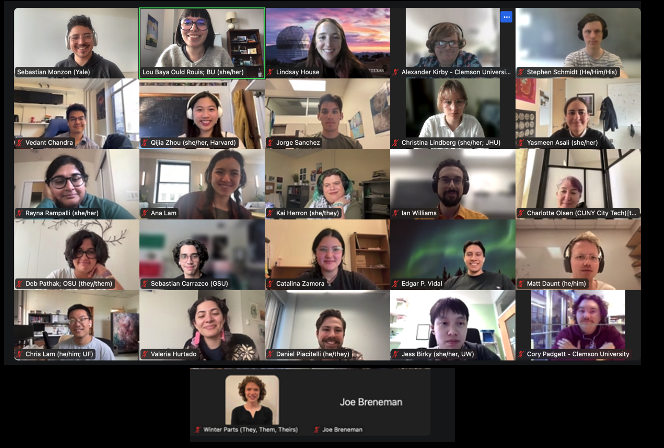

The Astro Grad Congress held its March General Body Meeting on **March 31st, 2025**, with **27 graduate representatives** in attendance.

The steering committee opened by giving the following updates and reminders:
- We have an AGC google account: [astrogradcongress@gmail.com](mailto:astrogradcongress@gmail.com)
- Sebastian gave a short presentation regarding recent budget cuts in space sciences. The slides are available [here](https://docs.google.com/presentation/d/1w5GpHvkzA5nzOwtNVBcIxgU5-WTaDebwFOA7vG5mq4M/edit?usp=sharing)!
- Lindsay introduced the [CHOIR Mutual Aid](https://www.choircollaboration.com/mutual-aid) fund which distributes aid to those in space sciences who have lost funding and have been affected by the current climate. CHOIR Mutual Aid is co-signed with the following organizations: [Black in Astro](https://www.blackinastro.com/), [Movement Consulting](https://www.wearemvmt.com/), and [The Astronomy Poverty Survey Team](https://github.com/apsa-team/aas245-special-session)

The meeting then moved to breakout rooms for subcommittee’s to continue working on their next steps. Details about each subcommittee can be found on this [AGC blog post](https://astro-grad-congress.github.io/update/).
